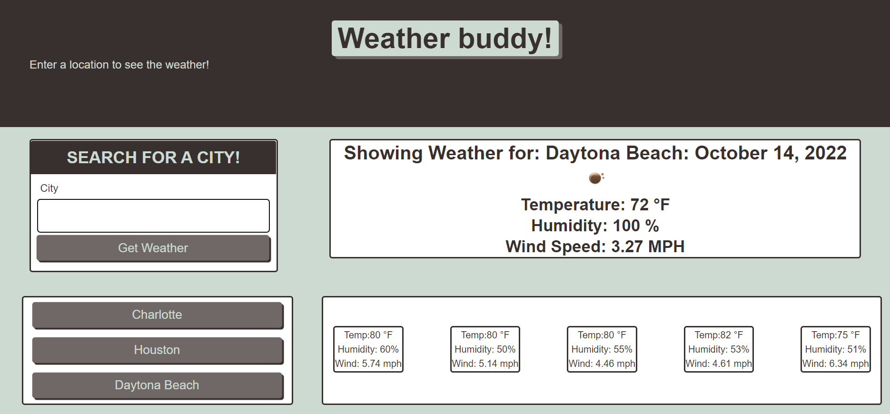

# Weather-Buddy-Challenge06

## Table of Contents

- [Weather-Buddy-Challenge06](#weather-buddy-challenge06)
  - [Table of Contents](#table-of-contents)
  - [Description](#description)
  - [Resources](#resources)
  - [Visuals](#visuals)
  - [Authors and Acknowledgments](#authors-and-acknowledgments)

## Description

This challenge assignment tasked us with creating a weather app using fetch and the OpenWeathermap Api.

This was accomplished by using lessons from the module as well as class time to implement jquery to make our js more efficient, bootstrap to quickly apply css to the page, localstorage to save our searches, and moment.js to get the time.

This was accomplished by reading the arrays to find the appropriate paths to display the data we wish to share on our page.
## Resources

- [LIVE SITE](https://jklaver91.github.io/Weather-Buddy-Challenge06/)

- [Repository](https://github.com/Jklaver91/Weather-Buddy-Challenge06)

## Visuals

## Authors and Acknowledgments

Code created by Bootcamp, optimized by Justin Klaver.